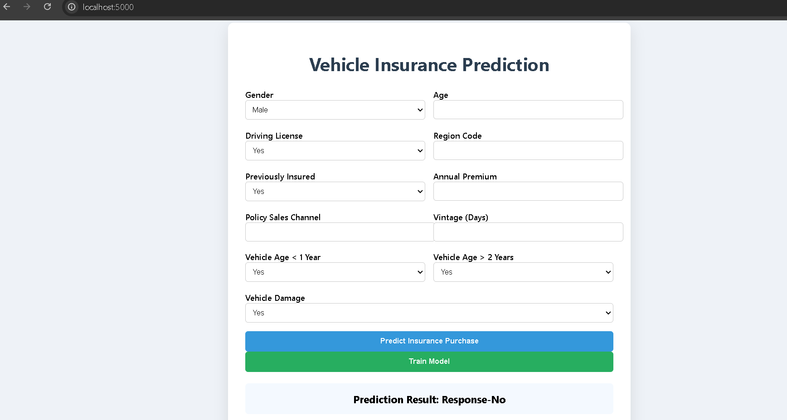
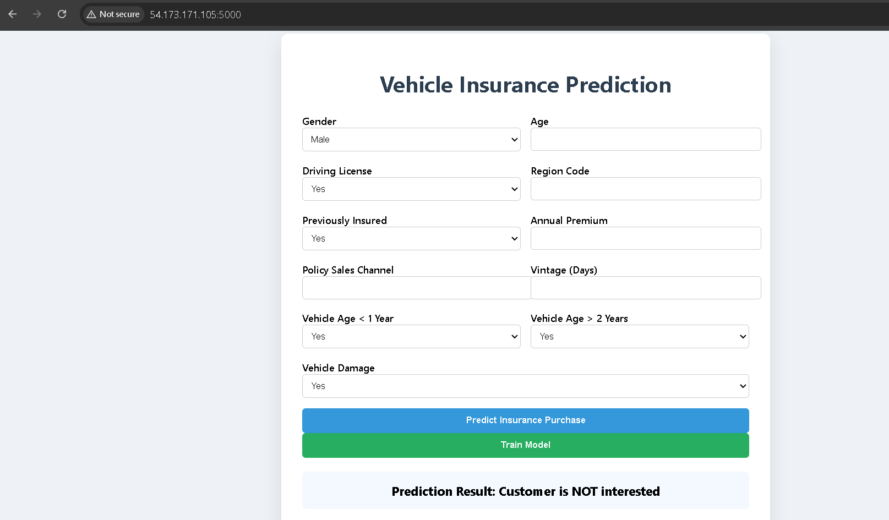

# 🚀 End-to-End MLOps Pipeline for Vehicle Insurance Prediction

An **end-to-end MLOps project** demonstrating how machine learning systems are built, automated, deployed, and continuously improved in production environments.

This project implements a **complete ML lifecycle**, including data ingestion, validation, transformation, model training, evaluation, deployment, **automated retraining**, and CI/CD automation using modern MLOps tools.

The system predicts **whether a customer is likely to purchase vehicle insurance** based on demographic and vehicle-related attributes, while ensuring the model stays updated through an automated retraining pipeline.

---

# 📊 Problem Statement

Insurance companies want to identify **customers who are most likely to purchase vehicle insurance** so they can target them effectively.

Using machine learning, this project predicts whether a customer will respond positively to a vehicle insurance offer.

This helps organizations:

* Reduce marketing costs
* Improve customer targeting
* Increase policy conversion rates
* Automate decision making

---

# 🏗️ Project Architecture

```
MongoDB Atlas
      │
      ▼
Data Ingestion
      │
      ▼
Data Validation
      │
      ▼
Data Transformation
      │
      ▼
Model Training
      │
      ▼
Model Evaluation
      │
      ▼
Model Registry (AWS S3)
      │
      ▼
Prediction API (FastAPI)
      │
      ▼
Web UI Interface
      │
      ▼
Docker Container
      │
      ▼
CI/CD Pipeline (GitHub Actions)
      │
      ▼
AWS EC2 Deployment
```

---

# 🛠️ Technologies Used

### Machine Learning

* Python
* Scikit-learn
* Pandas
* NumPy

### Backend

* FastAPI

### Database

* MongoDB Atlas

### Cloud Services

* AWS S3
* AWS EC2
* AWS ECR
* AWS IAM

### MLOps Tools

* Docker
* GitHub Actions
* CI/CD Automation

### Frontend

* HTML
* CSS
* Jinja Templates

---

# 📂 Project Structure

```
├── src
│   ├── components
│   │   ├── data_ingestion.py
│   │   ├── data_validation.py
│   │   ├── data_transformation.py
│   │   ├── model_trainer.py
│   │   ├── model_evaluation.py
│   │   └── model_pusher.py
│   │
│   ├── pipeline
│   │   ├── training_pipeline.py
│   │   └── prediction_pipeline.py
│   │
│   ├── configuration
│   ├── entity
│   ├── constants
│   └── utils
│
├── notebook
│   ├── EDA.ipynb
│   └── mongoDB_demo.ipynb
│
├── templates
│   └── vehicledata.html
│
├── static
│   └── css
│
├── Dockerfile
├── requirements.txt
├── setup.py
├── pyproject.toml
├── app.py
└── README.md
```

---

# ⚙️ ML Pipeline Workflow

### 1️⃣ Project Setup

Create project template

```
python template.py
```

Setup package imports using:

* `setup.py`
* `pyproject.toml`

Create environment

```
conda create -n vehicle python=3.10 -y
conda activate vehicle
pip install -r requirements.txt
```

Verify installation

```
pip list
```

---

# 🗄️ MongoDB Data Pipeline

Steps:

1. Create account in **MongoDB Atlas**
2. Create **M0 cluster**
3. Configure **database user**
4. Allow network access

```
0.0.0.0/0
```

Retrieve connection string and store as environment variable.

Push dataset to MongoDB using Jupyter Notebook.

```
notebook/mongoDB_demo.ipynb
```

---

# 🔍 Logging and Exception Handling

Implemented custom:

* Logging module
* Exception handling module

Used throughout the pipeline to ensure:

* traceability
* debugging
* monitoring

---

# 📥 Data Ingestion

Data is fetched from **MongoDB Atlas** and converted into a Pandas DataFrame.

Key components:

```
src/data_access
src/components/data_ingestion.py
```

MongoDB connection handled in

```
src/configuration/mongo_db_connections.py
```

Environment variable setup:

```
export MONGODB_URL="mongodb+srv://<username>:<password>"
```

---

# 🧹 Data Validation

Schema-based validation ensures dataset quality.

Files:

```
config/schema.yaml
utils/main_utils.py
```

Validation checks:

* Missing values
* Column types
* Schema consistency

---

# 🔄 Data Transformation

Feature engineering and preprocessing steps are applied before training.

Includes:

* encoding
* scaling
* feature selection

Files:

```
components/data_transformation.py
entity/estimator.py
```

---

# 🤖 Model Training

Machine learning models are trained using processed data.

Training pipeline handles:

* model training
* evaluation metrics
* artifact generation

Files:

```
components/model_trainer.py
pipeline/training_pipeline.py
```

---

# ☁️ AWS Cloud Integration

### AWS IAM

Create user and access keys.

Set environment variables:

```
export AWS_ACCESS_KEY_ID=""
export AWS_SECRET_ACCESS_KEY=""
```

---

# 🪣 AWS S3 Model Registry

Trained models are stored in **AWS S3 bucket**.

```
MODEL_BUCKET_NAME = "my-model-mlopsproj"
MODEL_PUSHER_S3_KEY = "model-registry"
```

Files:

```
src/aws_storage
entity/s3_estimator.py
```

---

# 🌐 Prediction API

A REST API built using **FastAPI** allows users to interact with the trained model.

Users can input vehicle and customer information through a web interface to receive predictions.

Main file:

```
app.py
```

---

# 🖥️ Web Interface

Simple UI built using:

* HTML
* CSS
* Jinja Templates

User inputs:

* Gender
* Age
* Driving License
* Vehicle Age
* Premium
* Sales Channel

Model predicts:

```
Customer likely to buy insurance
OR
Customer not interested
```

---

---

# 📸 Project Demo

### 🖥️ Running Locally

The application running locally using FastAPI.



---

### ☁️ CI/CD Deployment on AWS EC2

The application deployed using Docker, GitHub Actions CI/CD pipeline, and AWS EC2.



---

---

---

# 🐳 Docker Containerization

Application is containerized using Docker.

```
Dockerfile
.dockerignore
```

Benefits:

* portability
* environment consistency
* easy deployment

---

# 🔁 CI/CD Pipeline

Automated deployment using **GitHub Actions**.

Pipeline includes:

1. Build Docker Image
2. Push image to AWS ECR
3. Deploy to EC2

Workflow file:

```
.github/workflows/aws.yaml
```

---

# ☁️ AWS Deployment

Infrastructure used:

* **AWS EC2** → application server
* **AWS ECR** → Docker image registry
* **AWS S3** → model storage

EC2 instance runs Docker container serving the FastAPI application.

Access the app:

```
http://<EC2_PUBLIC_IP>:5080
```

---

# 🚀 Model Training Endpoint

Trigger model training from browser:

```
/train
```

---

# 📈 Key Features

✔ End-to-End ML pipeline
✔ Modular and production-style architecture
✔ Automated model training pipeline
✔ Automated model retraining workflow
✔ Model versioning using AWS S3
✔ REST API prediction service using FastAPI
✔ Interactive web UI for predictions
✔ Docker containerization
✔ CI/CD automation using GitHub Actions
✔ Cloud deployment on AWS EC2

---

# 👨‍💻 Author

Sadat Shakeeb

Machine Learning | MLOps | Data Science

---

# ⭐ If you found this project useful

Give this repo a ⭐ and feel free to connect!

---


